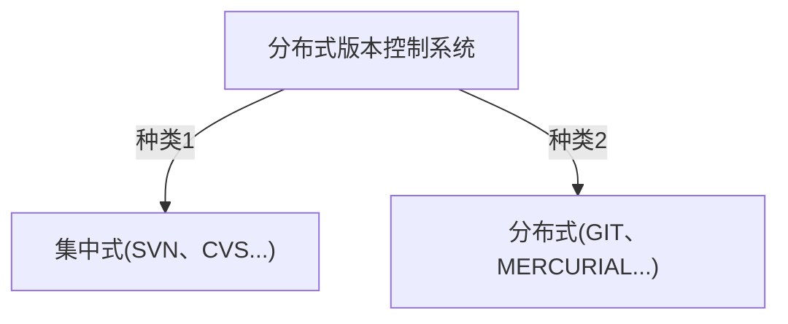
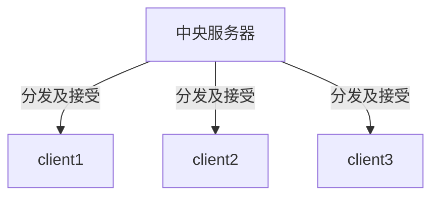
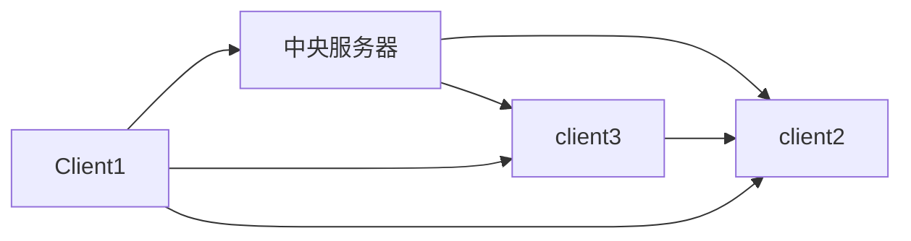

# GIT使用笔记

**git**  是 **分布式版本控制系统**

仓库中每个文件都有一个完整的版本历史记录 可以看到谁在什么时候修改了内容 需要的话可以恢复到之前的版本。

传统（什么都不用）：将一个文件复制备份 对备份进行修改 作为修订版。如果多个人对一个文件（项目）进行修改，就需要手工来合并两个人修改的内容 低效也麻烦。**版本控制系统就是用来解决这个问题，让项目成员之间的协作更加高效**
**分布式版本控制系统：**


TIP:md在节点使用符号得用双引号括起来
集中式：
代码都是从中央服务器下载，然后修改后进行提交。中央服务器挂了就可以下班了。

分布式：
代码从一个人进行发布开始 给所有人，每个人都能获取别人提交的代码 修改 并发布给所有人。等同于每个人都用有一个完整的仓库。



## git使用方式
1.命令行
2.图形界面GUI
3.IDE 例如使用vscode扩展

## git使用
第一步使用git config命令配置一下用户名和邮箱
```bash
git config --global user.name "Your Name "
#省略（Local）：本地配置，只对本地仓库有效
#--global : 全局配置，所有仓库生效
#--system :系统配置，对所有用户生效
git config --global user.email youremail@.com
git config --global credential.helper store
git config --global --list
```
##创建仓库
方式一：在本地这只文件夹为仓库
方式二：将github仓库克隆到本地
```bash 
git init
git clone
```
## unknown
工作区Working Directory
暂存区staging Area/Index
本地仓库Local Repository


```bash

#创建仓库
git init
#查看仓库的状态
git status
#添加到暂存区
git add
#提交
git commit

```